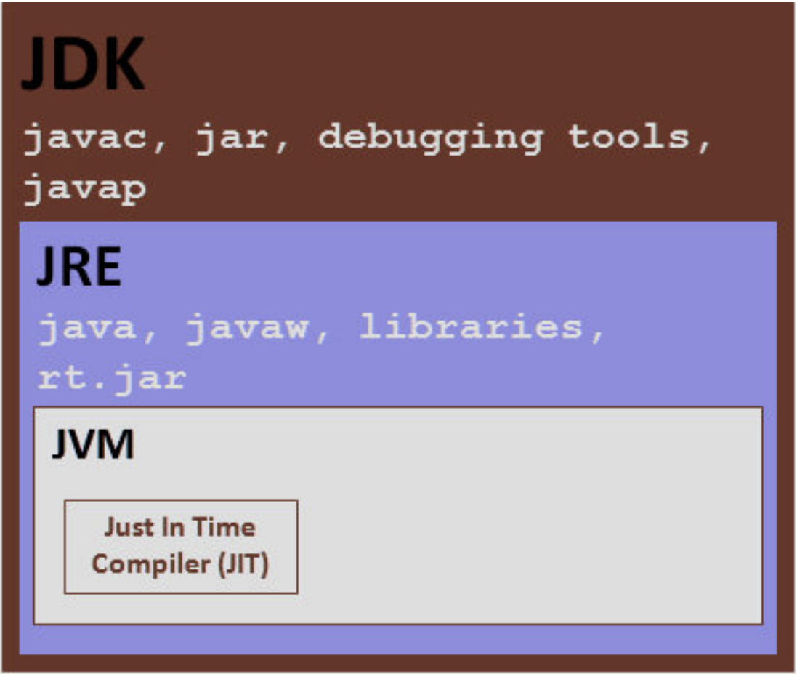

# Java-Interview-Questions

## Java Platform

### 1. Why is Java so Popular?
**Answer:**
Two	main	reasons	for	popularity	of	Java	are
1. Platform	Independence
2. Object	Oriented	Language

### 2. What	is	Platform	Independence?
**Answer:**
- Platform	Independence	is	also	called	build	once,	run	anywhere.	Java	is	one	of	the	most	popular	platform	
independent	languages.	Once	we	compile	a	java	program	and	build	a	jar,	we	can	run	the	jar	(compiled	
java	program)	in	any	Operating	System	- where	a	JVM	is	installed.
- Java	achieves	Platform	Independence	in	a	beautiful	way.	On	compiling	a	java	file	the	output	is	a	class	file	which	contains	an	internal	java	representation	called	bytecode.	JVM	converts	bytecode	to	executable	
instructions.	 The	 executable	 instructions	 are	 different	 in	 different	 operating	 systems.	 So,	 there	 are	
different	 JVM's	 for	 different	 operating	 systems.	 A	 JVM	 for	 windows	 is	 different	 from	 a	 JVM	 for	 mac.	
However,	 both	 the	 JVM's	 understand	 the	 bytecode	 and	 convert	 it	 to	 the	 executable	 code	 for	 the	
respective	operating	system.

### 3. What	is	ByteCode?
**Answer:**
Java	bytecode	is	the	instruction	set	of	the	Java	virtual	machine.	Each	bytecode	is	composed	of	one,	or	in	
some	cases	two	bytes	that	represent	the	instruction	(opcode),	along	with	zero	or	more	bytes	for	passing	
parameters.

### 4. Compare	JDK	vs	JVM	VS	JRE.
**Answer:**

1. JVM
a. Virtual	machine	that	run	the	Java	bytecode.
b. Makes	java	portable.
2. JRE
a. JVM	+	Libraries	+	Other	Components	(to	run	applets	and	other	java	applications)

3. JDK
a. JRE	+	Compilers	+	Debuggers

### 5. What	are	the	important	differences	between	C++	and	Java?
**Answer:**
1. Java	is	platform	independent.	C++	is	not	platform	independent.
2. Java &	C++	are	both	NOT	pure	Object	Oriented	Languages.	However,	Java is	more purer	Object	
Oriented	 Language	 (except	 for	 primitive	 variables).	 In	 C++,	 one	 can	 write	 structural	 programs	
without	using	objects.
3. C++	has	pointers	(access	to	internal	memory).	Java	has	no	concept	called	pointers.
4. In	C++,	programmer	has	 to	handle	memory	management.	A	programmer	has	 to	write	code	 to	
remove	 an	 object	 from	 memory.	 In	 Java,	 JVM	 takes	 care	 of	 removing	 objects	 from	 memory	
using	a	process	called	Garbage	Collection.
5. C++	supports	Multiple	Inheritance.	Java	does	not	support	Multiple	Inheritance.